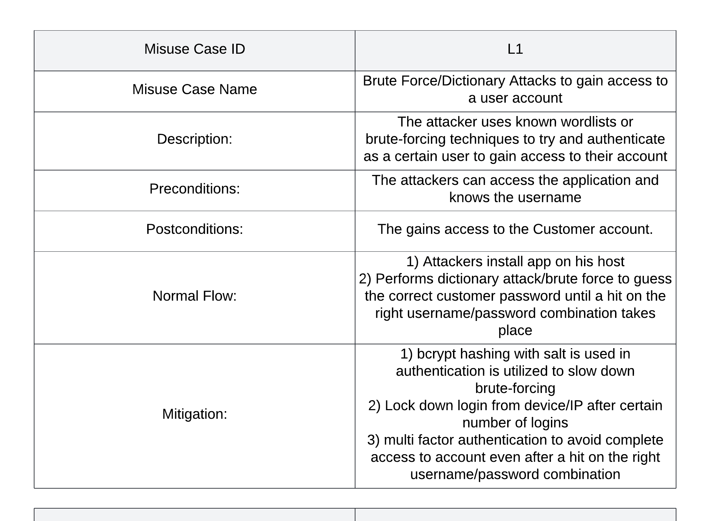
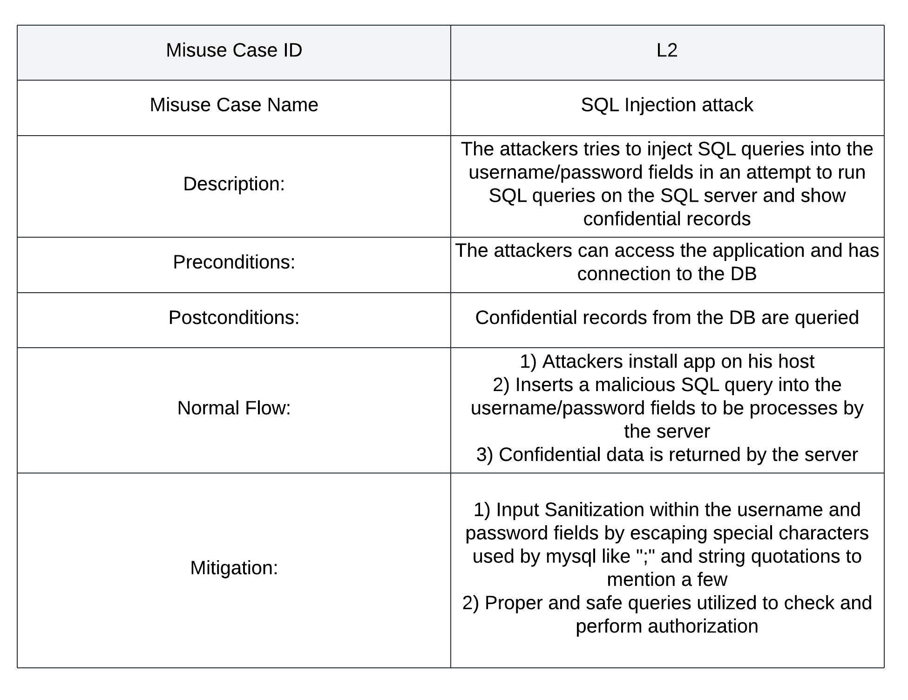
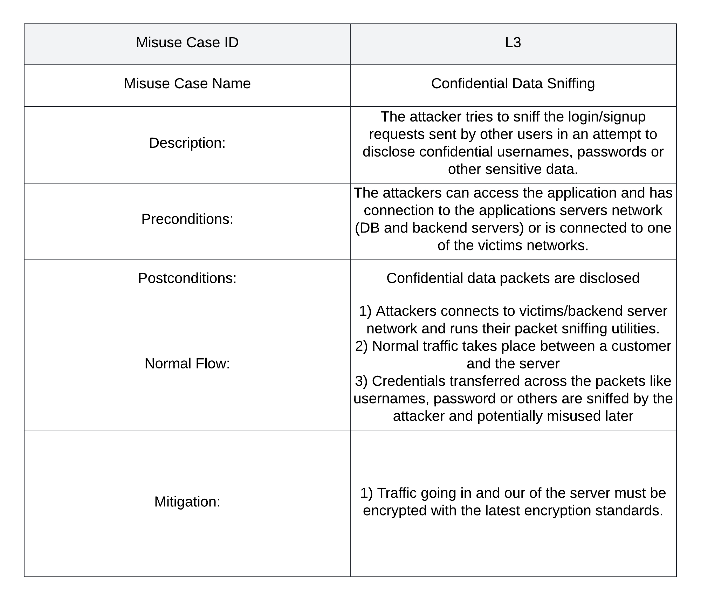
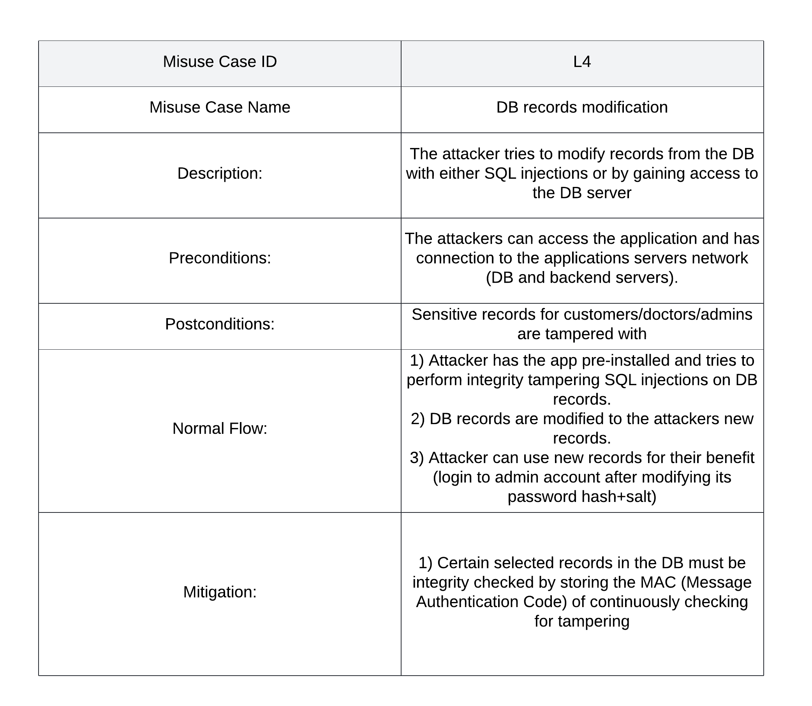
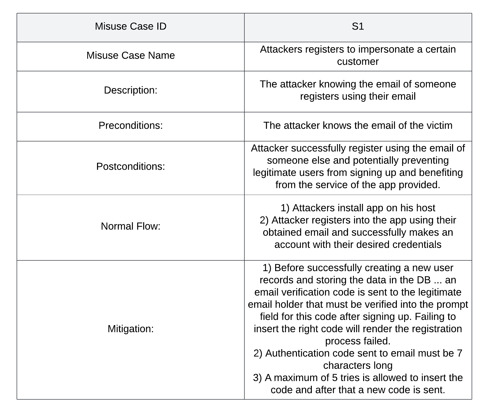

# Pet Registration & Management System for vet centers - A Software Security Project

This is a software security project aimed at building a software for managing pets within vet centers using a secure and a well designed software infrastructure.
## Package Requirements

> The Following Python Packages:

**1. Python Customtkinter library**
```pip install customtkinter```

**2. mysql connector**
```pip install mysql-connector-python```

**3. Pillow**
```pip install pillow```

**4. bcrypt**
```pip install bcrypt```

**5. PyCrypto**
```pip install pycrypto```


### Database Tables Utilized
> [!NOTE]
> **Make sure they are all within the same database schema**
<details>
<summary><b>Users Table</b></summary>
<pre>
CREATE TABLE users (
    UID INT PRIMARY KEY AUTO_INCREMENT,
    username VARCHAR(255) NOT NULL UNIQUE,
    password_hash VARCHAR(255) NOT NULL,
    name VARCHAR(255) NOT NULL,
    email VARCHAR(255) NOT NULL UNIQUE,  #Add email for user contact
    salt BINARY(16) NOT NULL,  #Move salt before role
    role ENUM('normal_user', 'doctor', 'admin') NOT NULL DEFAULT 'normal_user'
);
</pre>
</details>

<details>
<summary><b>Available Pets Table</b></summary>
<pre>
CREATE TABLE pets (
        id INT AUTO_INCREMENT PRIMARY KEY,
        name VARCHAR(255) NOT NULL,
        species VARCHAR(255) NOT NULL,
        age VARCHAR(50) NOT NULL,
        image_path VARCHAR(255) NOT NULL
);
</pre>
</details>

<details>
<summary><b>Customers Table</b></summary>
<pre>
CREATE TABLE customer (
    id INT AUTO_INCREMENT PRIMARY KEY,
    name VARCHAR(255) NOT NULL,
    email VARCHAR(255) NOT NULL,
    location VARCHAR(255) NOT NULL,
    adopted_pet VARCHAR(255) NOT NULL
);
</pre>
</details>


## Functional & Non-functional Requirements
<details>
<summary><b>Functional Requirements</b></summary>

* Users must be logged in before being able to view the available pets dasboard (no anonymous viewing)
* 2FA must be implemented over sensitive accounts including the admins and the doctor accounts. 
Passwords must be complex for all accounts (10 characters min - use of special characters, symbols, numbers and upper and lower characters is mandatory)
* Passwords are stored as bcrypt salted hashes along with their salt and password authentication are done by hashing to limit brute forcing activities and slow them down.
* Doctors will be able to add the available pets for adoption in which users can choose from from their adoption dashboard.
* A database backup must be held in a seperate host.
* Backups must be performed every 2 days
* Only admin users will be able to register users of any role including new doctors, new admins and new normal privileged users (Customers).
* Customer users are the only ones able to change their profile info like their email, password, and full name.
</details>

<details>
<summary><b>Non-Functional Requirements</b></summary>

* **Security** - The app must safe for use and prevents potential misuses by adversaries
* **Reliability** - App must be available to users as much as possible and is resistant to any Denial of Service attack.
* **Performance** - Delays in displaying web pages and performing app functionality are minimized.
* **Scalability** - Servers can be potentially scalled out depending on the demand by relying on additional cloud host servers that are flexible to scale in/out.
* **Usability** - A user-friendly front end is available for end users to ensure a smooth experience
</details>

## Use Cases
<details>
<summary><b>Use Case Diagrams</b></summary>


</details>

## Misuse Cases
<details>
<summary><b>Login Misuse Cases</b></summary>










</details>

<details>
<summary><b>Customer Signup Misuse Cases</b></summary>




</details>